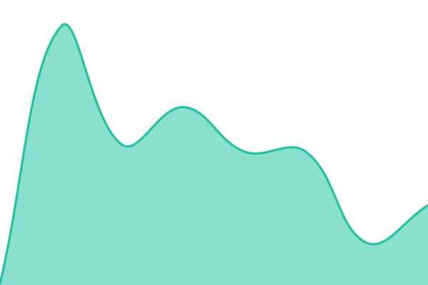
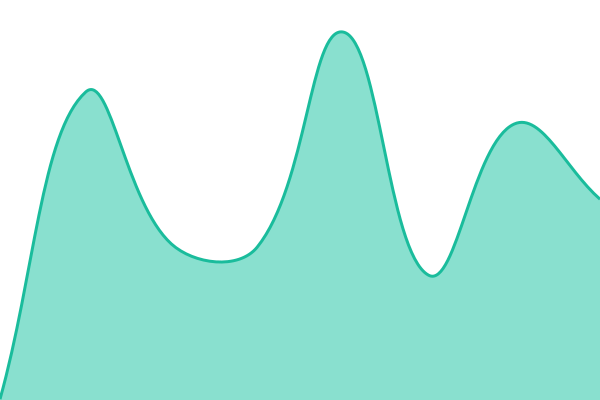

# [📈 Live Status](https://status.city-ol.ch): <!--live status--> **🟩 All systems operational**

This repository contains the open-source uptime monitor and status page for [Upptime](https://upptime.js.org), powered by [Upptime](https://github.com/upptime/upptime).

With [Upptime](https://upptime.js.org), you can get your own unlimited and free uptime monitor and status page, powered entirely by a GitHub repository. We use [Issues](https://github.com/upptime/upptime/issues) as incident reports, [Actions](https://github.com/City-OL/upptime-status/actions) as uptime monitors, and [Pages](https://status.city-ol.ch) for the status page.

<!--start: status pages-->
<!-- This summary is generated by Upptime (https://github.com/upptime/upptime) -->
<!-- Do not edit this manually, your changes will be overwritten -->
<!-- prettier-ignore -->
| URL | Status | History | Response Time | Uptime |
| --- | ------ | ------- | ------------- | ------ |
|  [Web App (app.city-ol.ch)](https://app.city-ol.ch) | 🟩 Up | [webapp.yml](https://github.com/City-OL/upptime-status/commits/HEAD/history/webapp.yml) | 

 385ms
     
 | 

<a href="https://status.city-ol.ch/history/webapp">100.00%</a>
    

|  [Backend](https://europe-west6-city-ol.cloudfunctions.net/status) | 🟩 Up | [backend.yml](https://github.com/City-OL/upptime-status/commits/HEAD/history/backend.yml) | 

 2308ms
     
 | 

<a href="https://status.city-ol.ch/history/backend">100.00%</a>
    

|  [Tile Server](https://city-ol-api1.web.app/tiles/v4/aarau/16/34238/22952.png) | 🟩 Up | [tile-server.yml](https://github.com/City-OL/upptime-status/commits/HEAD/history/tile-server.yml) | 

 137ms
     
 | 

<a href="https://status.city-ol.ch/history/tile-server">100.00%</a>
    

|  [Website (city-ol.ch)](https://city-ol.ch/) | 🟩 Up | [website.yml](https://github.com/City-OL/upptime-status/commits/HEAD/history/website.yml) | 

 317ms
     
 | 

<a href="https://status.city-ol.ch/history/website">100.00%</a>
    

|  [Website Alias (cityol.ch)](https://cityol.ch) | 🟩 Up | [website-alias-cityol.yml](https://github.com/City-OL/upptime-status/commits/HEAD/history/website-alias-cityol.yml) | 

 596ms
     
 | 

<a href="https://status.city-ol.ch/history/website-alias-cityol">100.00%</a>
    

|  [Website Alias (city-ol-brugg.com)](https://city-ol-brugg.com) | 🟩 Up | [website-alias-cityolbrugg.yml](https://github.com/City-OL/upptime-status/commits/HEAD/history/website-alias-cityolbrugg.yml) | 

 563ms
     
 | 

<a href="https://status.city-ol.ch/history/website-alias-cityolbrugg">100.00%</a>
    

<!--end: status pages-->

[**Visit our status website →**](https://status.city-ol.ch)

## 📄 License

- Powered by: [Upptime](https://github.com/upptime/upptime)
- Code: [MIT](./LICENSE) © [Anand Chowdhary](https://anandchowdhary.com), supported by [Pabio](https://pabio.com)
- Data in the `./history` directory: [Open Database License](https://opendatacommons.org/licenses/odbl/1-0/)
